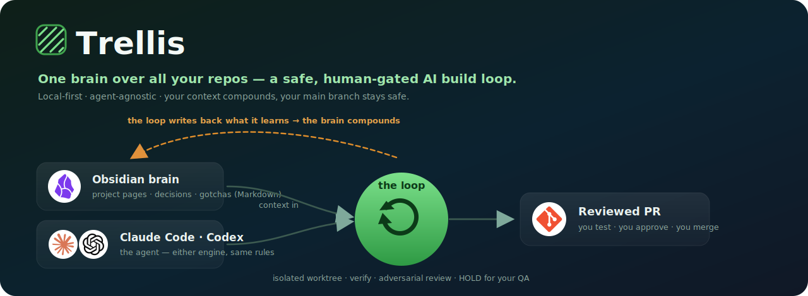
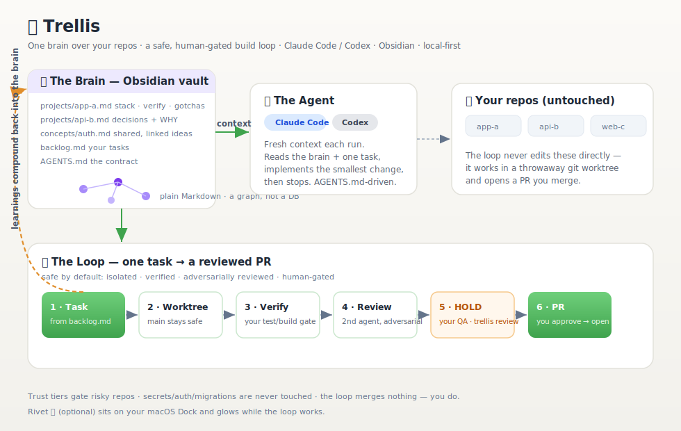
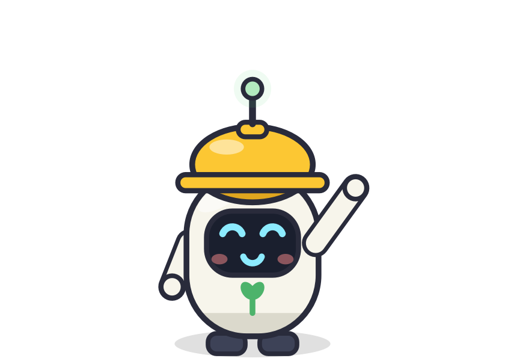

<div align="center">



<br/><br/>

[](https://claude.com/claude-code)
[](https://openai.com/codex)
[](https://obsidian.md)
<br/>


<br/>

**One brain over all your code projects — plus a safe, human-gated AI build loop.**
Give your coding agent a persistent, self-maintaining memory of every repo you work on (plain
Markdown in [Obsidian](https://obsidian.md)) and a loop that turns a one-line task into a
**reviewed pull request** — without ever touching your main branch or merging on its own.

</div>

---

## The problem

If you juggle many repositories, your AI agent starts **cold in every one**. You re-explain the
stack, the conventions, the gotchas, the "don't touch that" rules — every single session. Context
evaporates the moment you close the tab. And when you *do* let an agent build, you're one
over-eager diff away from a scope-creep mess or an accidental push to `main`.

**Trellis fixes both** with two ideas that reinforce each other:

1. **A brain that compounds.** Every project gets one Markdown page — stack, run/verify commands,
   decisions *and the reasoning behind them*, gotchas, sensitive areas. The loop reads it before
   working and **writes back what it learns** after. Your past Claude/Codex conversations can be
   harvested and distilled into these pages automatically, so knowledge accrues instead of leaking.

2. **A loop that's safe by default.** `task → build in an isolated git worktree → run your verify
   command → adversarial review by a second agent → stop and wait for your QA → you approve → PR.`
   It never merges, never edits your checkout, and never touches secrets, auth, or migrations.

---

## How it works

<div align="center">
  
</div>

Three parts, one feedback loop:

### 🧠 1. The Brain — an Obsidian vault

Plain Markdown. A graph, not a database. One page per repo:

```markdown
---
title: Payments API
path: /Users/you/code/payments-api    # absolute path to the real repo
trust: high                           # safe | standard | high
verify: "npm run build && npm run test"
tags: [node, payments]
related: ["[[Idempotency]]", "[[Webhook Signing]]"]
---

# Payments API

## Decisions
- Stripe webhooks are verified with the raw body, not the parsed one — WHY: signature
  is computed over bytes; body-parser mutates them. (learned the hard way, 2026-02)

## Gotchas
- `migrations/` is off-limits to the loop — schema changes go through a human review.

## Current focus
- Adding idempotency keys to the refund endpoint.
```

Project pages link to shared **concept** pages (`concepts/auth.md`, `concepts/idempotency.md`) —
those are the graph edges, so the agent inherits cross-cutting context without you repeating it.
Open the vault in Obsidian for the graph view, or just read the Markdown. It's yours, forever, offline.

### 🤖 2. The Agent — Claude Code *or* Codex

`AGENTS.md` is the single source of truth for how the agent behaves; `CLAUDE.md` is one line
(`@AGENTS.md`), so the **same rules apply to any engine**. Swap with an env var — no rework:

```bash
trellis run                 # uses Claude Code by default
AGENT=codex trellis run     # same task, Codex
QA_AGENT=codex trellis run  # build with Claude, have Codex adversarially review it
```

Each run starts with **fresh context** (no drift), reads the brain + exactly one task, makes the
**smallest change** that satisfies it, and stops. Continuity lives in files you can read and edit —
not in a model's fading memory.

### 🔁 3. The Loop — one task → a reviewed PR

```
  trellis add            trellis run                                    trellis review
       │                     │                                               │
   backlog.md ──▶  ①  ──▶  ②  ──▶  ③  ──▶  ④  ──▶  ⑤  HOLD ────────────▶  ⑥  PR ──▶ you merge
                  Task  Worktree Verify Review   (your QA:                 (only after
                        main safe  gate  2nd     trellis test /             you approve)
                                        agent    trellis review)
```

| Stage | What happens | Why it's safe |
|------:|--------------|---------------|
| **① Task** | Top item from `backlog.md` (with `repo::` / `verify::` / `accept::`) | You wrote it; the agent doesn't invent work |
| **② Worktree** | Builds on a throwaway branch off the latest remote base | Your checkout & `main` are never modified |
| **③ Verify** | Runs *your* build/test command, reads the output | Machine gate — the agent's word isn't trusted |
| **④ Review** | A **second** agent tries to *reject* the diff (scope creep, cheating, unmet criteria) | Adversarial, defaults to FAIL; can be a different model |
| **⑤ Hold** | Commits the branch and **stops** | Nothing reaches your remote yet |
| **⑥ PR** | You run `trellis review`, approve → it opens the PR | **You** merge, always |

And the loop's discoveries — a new gotcha, a decision, a fix — get **written back into the project
page**, so the next run on that repo is smarter. That's the compounding arrow in the diagram.

---

## Quickstart

```bash
git clone https://github.com/sagar-1199/trellis-oss.git
cd trellis-oss
./install.sh                 # puts `trellis` on your PATH, creates ~/.trellis

# This folder IS your brain (a vault). Open it in Obsidian, then:
#   replace projects/example-app.md with a real project (set its `path:`)

trellis                      # the menu — everything from here
```

Your first task, end to end:

```bash
trellis add        # title · which repo · what "done" means
trellis run        # clarify → build → verify → review → HOLDS for your QA
trellis test app   # optional: boot the built branch locally and click through it
trellis review     # approve → opens the PR (you merge)
```

The loop is **DRY-RUN by default** and **holds PRs for your review** — nothing touches your repos
or GitHub until you say so.

---

## Commands

| Command | What it does |
|---|---|
| `trellis` | the menu (pick a number) |
| `trellis add` | add a task to the backlog |
| `trellis run` | clarify → build → verify → review → **hold for your QA** |
| `trellis review` | approve a built branch → open its PR |
| `trellis test <repo>` | run a built branch locally to click through it |
| `trellis ask [repo]` | read-only Q&A about a project (no changes) |
| `trellis sync` | harvest your agent conversations → distill into project pages |
| `trellis metrics` | accepted-change rate (the loop's report card) |
| `trellis retro` | learn from merges/edits; propose gate tweaks (you approve) |
| `trellis health` | vault sanity check |

---

## Designed for real engineering

- **Isolated worktrees** — every task builds on a throwaway branch off the *latest remote base*, so
  PRs are conflict-free and your working copy is never touched.
- **Trust tiers** (`safe` / `standard` / `high`) per project. `high` = PR-only, and the loop
  **refuses** to touch `auth/`, `payment*/`, `migrations/`, `.env*`, `*.pem`, or anything secret.
- **Anti-reward-hacking** — the machine gate rejects edits that weaken existing tests, placeholder
  stubs, and diffs that balloon past size caps. The agent can't "make it pass" by cheating.
- **Adversarial review** — a second agent (optionally a *different* model) reviews before a diff is
  ever PR-eligible, defaulting to FAIL when unsure.
- **Human-gated** — the loop holds after review; you test and approve. It **merges nothing**.
- **Measured** — `trellis metrics` tracks your accepted-change rate; `trellis retro` turns merges
  and edits into lessons on the project pages and *proposes* (never auto-applies) gate tweaks.

---

## 🤖 Meet Rivet — the optional Dock buddy



A tiny worker robot that lives on your **macOS Dock** and shows, at a glance, what your agent is
doing:

- 🟢 **green antenna** — idle, dozing in the corner
- 🟠 **orange antenna** — Claude / the loop is actively working (with a status bubble)
- 😴 **asleep** — nothing running

Double-click `buddy/Start Buddy.command` — it self-bootstraps and starts at login. Purely cosmetic;
skip it on non-Mac. He glows while the factory runs.

<br clear="right"/>

---

## Requirements

- **macOS or Linux**, `bash`, `git`, `python3`
- An agent CLI on your PATH: [Claude Code](https://claude.com/claude-code) (`claude`) or
  [Codex](https://openai.com/codex) (`codex`)
- [`gh`](https://cli.github.com) for opening PRs
- [Obsidian](https://obsidian.md) to view/edit the brain (optional — it's just Markdown)
- Rivet only: macOS + Python (auto-installs its own deps on first run)

## Agent-agnostic by design

`AGENTS.md` is the contract; `CLAUDE.md` imports it. Adding a new agent CLI is a few lines in
`loop/config.sh` (`run_agent` / `run_reviewer`). The design constraints — **file-based,
local-first, human-gated, agent-agnostic** — are intentional.

## Contributing

Issues and PRs welcome. Proposals that keep the constraints above are the easiest to land.

## License

[MIT](LICENSE) © Vidyasagar Chamle
